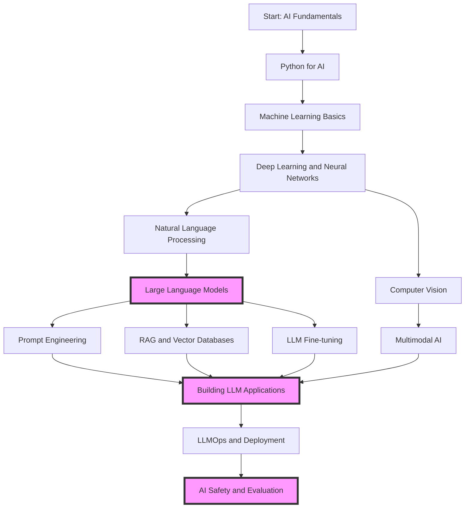

# Generative AI Roadmap

This roadmap is designed to provide a comprehensive guide through the world of Large Language Models (LLMs) and related AI technologies. It caters to learners at various skill levels, from beginners to advanced practitioners. The courses are carefully curated from DeepLearning.AI's short courses, organized to provide a logical progression of skills and knowledge.

### [Tracker](https://docs.google.com/spreadsheets/d/1S9xW_dAWHzD3Wm8NB5cLYhZdVV1hzeLNHDtBZ_y4ZX4/edit?usp=sharing)

## Detailed Course Information

### 1. Foundations

| Topic | Course | Skill Level | Description |
|-------|--------|-------------|-------------|
| AI Fundamentals | [AI Python for Beginners](https://www.deeplearning.ai/short-courses/ai-python-for-beginners/) | Beginner | Learn Python programming with AI assistance. Gain skills in writing, testing, and debugging code efficiently. |
| Machine Learning Basics | N/A | Beginner | Understanding basic ML concepts is crucial before diving into deep learning. |
| Deep Learning | [How Diffusion Models Work](https://www.deeplearning.ai/short-courses/how-diffusion-models-work/) | Intermediate | Learn and build diffusion models from the ground up, understanding each step. |

### 2. Natural Language Processing and LLMs

| Topic | Course | Skill Level | Description |
|-------|--------|-------------|-------------|
| NLP Basics | [Understanding and Applying Text Embeddings](https://www.deeplearning.ai/short-courses/google-cloud-vertex-ai/) | Beginner | Learn how to accelerate the application development process with text embeddings for sentence and paragraph meaning. |
| Large Language Models | [ChatGPT Prompt Engineering for Developers](https://www.deeplearning.ai/short-courses/chatgpt-prompt-engineering-for-developers/) | Beginner | Learn the fundamentals of prompt engineering for ChatGPT. |
| Advanced LLM Techniques | [Reinforcement Learning from Human Feedback](https://www.deeplearning.ai/short-courses/reinforcement-learning-from-human-feedback/) | Intermediate | Get an introduction to tuning and evaluating LLMs using Reinforcement Learning from Human Feedback (RLHF). |

### 3. Prompt Engineering and RAG

| Topic | Course | Skill Level | Description |
|-------|--------|-------------|-------------|
| Prompt Engineering | [Prompt Engineering with Llama 2 & 3](https://www.deeplearning.ai/short-courses/prompt-engineering-with-llama-2/) | Beginner | Learn best practices for prompting and selecting among Meta Llama 2 & 3 models. |
| RAG and Vector Databases | [Building Applications with Vector Databases](https://www.deeplearning.ai/short-courses/building-applications-vector-databases/) | Beginner | Learn to build six applications powered by vector databases, including semantic search and RAG. |
| Advanced RAG | [Building and Evaluating Advanced RAG Applications](https://www.deeplearning.ai/short-courses/building-evaluating-advanced-rag/) | Beginner | Learn advanced RAG retrieval methods and evaluate your pipeline's performance. |

### 4. LLM Fine-tuning and Optimization

| Topic | Course | Skill Level | Description |
|-------|--------|-------------|-------------|
| Model Optimization | [Quantization Fundamentals with Hugging Face](https://www.deeplearning.ai/short-courses/quantization-fundamentals-with-hugging-face/) | Beginner | Learn how to quantize any open-source model. Learn to compress models with the Hugging Face Transformers library and the Quanto library. |
| LLM Fine-tuning | [Finetuning Large Language Models](https://www.deeplearning.ai/short-courses/finetuning-large-language-models/) | Intermediate | Discover when to use finetuning vs prompting for LLMs. Select suitable open-source models, prepare data, and train & evaluate for your specific domain. |

### 5. Building LLM Applications

| Topic | Course | Skill Level | Description |
|-------|--------|-------------|-------------|
| LangChain | [LangChain for LLM Application Development](https://www.deeplearning.ai/short-courses/langchain-for-llm-application-development/) | Beginner | Use the powerful and extensible LangChain framework for building LLM applications. |
| Function Calling | [Function-Calling and Data Extraction with LLMs](https://www.deeplearning.ai/short-courses/function-calling-and-data-extraction-with-llms/) | Beginner | Learn to apply function-calling to expand LLM and agent application capabilities. |
| AI Agents | [AI Agents in LangGraph](https://www.deeplearning.ai/short-courses/ai-agents-in-langgraph/) | Intermediate | Build agentic AI workflows using LangChain's LangGraph and Tavily's agentic search. |

### 6. LLMOps and Deployment

| Topic | Course | Skill Level | Description |
|-------|--------|-------------|-------------|
| LLMOps | [LLMOps](https://www.deeplearning.ai/short-courses/llmops/) | Beginner | Learn LLMOps best practices as you design and automate steps to fine-tune and deploy an LLM for a specific task. |
| Efficient Serving | [Efficiently Serving LLMs](https://www.deeplearning.ai/short-courses/efficiently-serving-llms/) | Intermediate | Understand how LLMs predict the next token and how techniques like KV caching can speed up text generation. |
| Automated Testing | [Automated Testing for LLMOps](https://www.deeplearning.ai/short-courses/automated-testing-llmops/) | Intermediate | Learn how to create an automated CI pipeline to evaluate your LLM applications on every change. |

### 7. AI Safety and Evaluation

| Topic | Course | Skill Level | Description |
|-------|--------|-------------|-------------|
| Quality and Safety | [Quality and Safety for LLM Applications](https://www.deeplearning.ai/short-courses/quality-safety-llm-applications/) | Beginner | Learn how to evaluate the safety and security of your LLM applications and protect against risks. |
| Red Teaming | [Red Teaming LLM Applications](https://www.deeplearning.ai/short-courses/red-teaming-llm-applications/) | Beginner | Learn how to make safer LLM apps through red teaming. Learn to identify and evaluate vulnerabilities in LLM applications. |

### 8. Computer Vision and Multimodal AI

| Topic | Course | Skill Level | Description |
|-------|--------|-------------|-------------|
| Computer Vision | [Prompt Engineering for Vision Models](https://www.deeplearning.ai/short-courses/prompt-engineering-for-vision-models/) | Beginner | Learn prompt engineering for vision models using Stable Diffusion, and advanced techniques like object detection and in-painting. |
| Multimodal AI | [Introducing Llama 3.2](https://www.deeplearning.ai/short-courses/introducing-llama-3-2/) | Beginner | Build multimodal applications using Llama's new 3.2 multimodal models. |
| Multimodal RAG | [Multimodal RAG: Chat with Videos](https://www.deeplearning.ai/short-courses/multimodal-rag-chat-with-videos/) | Intermediate | Build an interactive system for querying video content using multimodal AI. |

## Specialization Tracks

### LLM Development Track
Focus: Prompt Engineering → RAG → LLM Fine-tuning → Building LLM Applications → LLMOps

### AI Safety and Evaluation Track
Focus: Quality and Safety → Red Teaming → Automated Testing → LLMOps

### Multimodal AI Track
Focus: Computer Vision → Multimodal AI → Multimodal RAG → Building LLM Applications

## Learning Tips

1. **Start with the Basics**: Ensure you have a solid foundation in Python and basic ML concepts before diving into LLMs.
2. **Hands-on Practice**: Apply what you learn through coding exercises and projects after each course.
3. **Build a Portfolio**: As you progress, create and showcase LLM-based projects demonstrating your skills.
4. **Stay Updated**: The LLM field evolves rapidly. Follow reputable sources and take new courses as they become available.
5. **Collaborate and Share**: Join AI communities, participate in forums, and share your learnings with others.
6. **Focus on Ethics**: Always consider the ethical implications of LLM applications you're building or studying.

Remember, this roadmap is flexible. Feel free to adjust the order based on your interests, prior knowledge, and career goals. The world of LLMs is vast and constantly evolving – embrace the journey of continuous learning!
